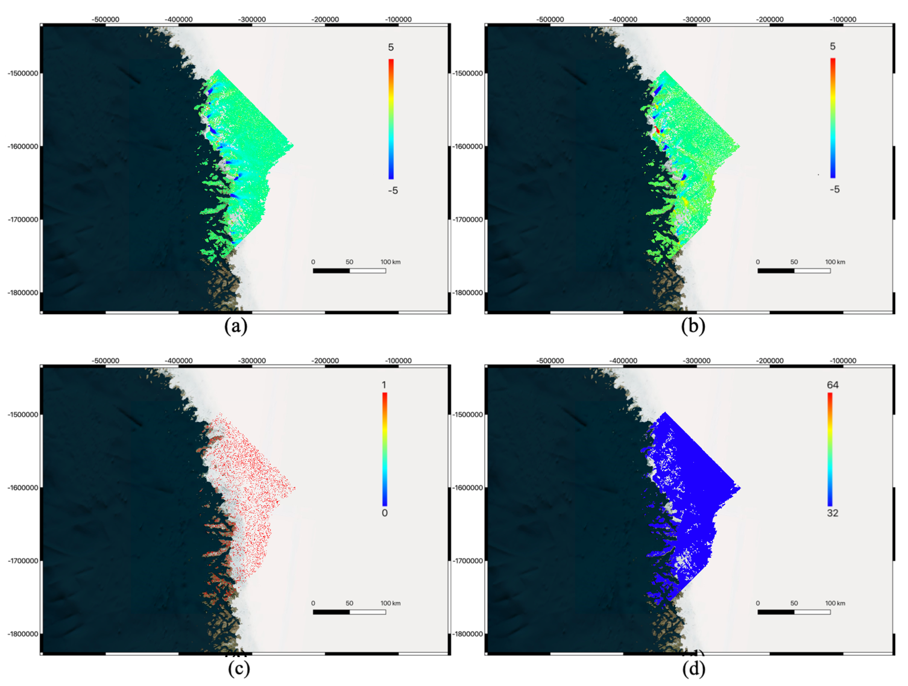
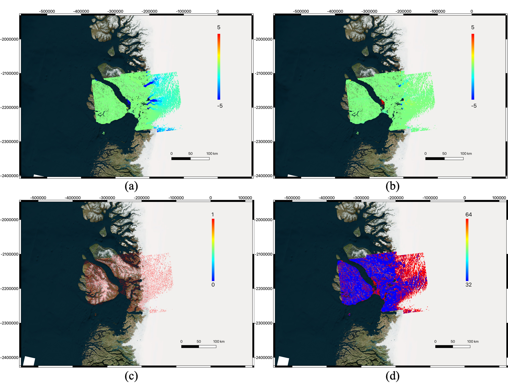
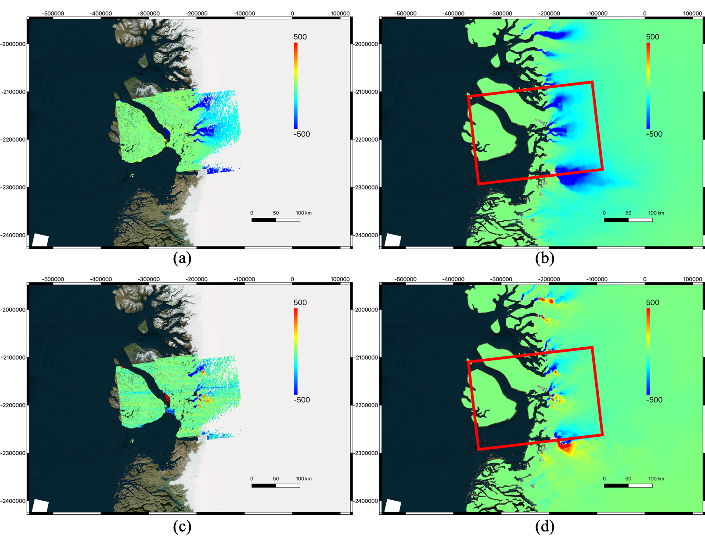

## 5. Demo

### 5.1 Optical image over regular grid in image coordinates


***Output of "autoRIFT" module for a pair of Landsat-8 images (2017-07-08 and 2017-07-24) in Greenland over a regular-spacing grid: (a) estimated horizontal pixel displacement, (b) estimated vertical pixel displacement, (c) chip size used, (d) light interpolation mask.***

This is done by implementing the following command line:

```shell
testautoRIFT.py -m I1 -s I2 -fo 1
```

where "I1" and "I2" are the reference and secondary images. The "-fo" option indicates that reference and secondary contain optical image data.

### 5.2 Optical image over user-defined map-projected Cartesian coordinate grid



***Output of "autoRIFT" module for a pair of Landsat-8 images (2017-07-08 and 2017-07-24) in Greenland over user-defined map-projected Cartesian (northing/easting) coordinate grid: (a) estimated horizontal pixel displacement (in pixels), (b) estimated vertical pixel displacement (in pixels), (c) light interpolation mask, (d) chip size used (in pixels). Notes: all maps are established exactly over the same map-projected Cartesian coordinate grid from input.***

This is done by implementing the following command line:

```shell
testautoRIFT.py -m I1 -s I2 -g winlocname -o winoffname -sr winsrname -csmin wincsminname -csmax wincsmaxname -vx winro2vxname -vy winro2vyname -fo 1
```
       
where "I1" and "I2" are the reference and secondary images and the optional inputs "winlocname", "winoffname", "winsrname", "wincsminname", "wincsmaxname", "winro2vxname", "winro2vyname" are outputs from running "testGeogrid.py". For the simplified use when the geocoded product is desired, "winlocname" (grid location) must be specified (otherwise a regular image grid will be used) and each of the rest optional input ("win * name") can be either used or omitted. Please remember to append the "-fo 1" flag for reading optical image data.


***Final motion velocity results by combining outputs from "Geogrid" (i.e. matrix of conversion coefficients) and "autoRIFT" modules (i.e. estimated horizontal/vertical pixel displacement shown above): (a) estimated motion velocity from Landsat-8 data (x-direction; in m/yr), (b) reference motion velocity from input data (x-direction; in m/yr), (c) estimated motion velocity from Landsat-8 data (y-direction; in m/yr), (d) reference motion velocity from input data (y-direction; in m/yr). Notes: all maps are established exactly over the same map-projected Cartesian (northing/easting) coordinate grid from input.***


### 5.3 Radar image over regular grid in image coordinates


***Output of "autoRIFT" module for a pair of Sentinel-1A/B images (2017-02-21 and 2017-02-27) at Jakobshavn Glacier of Greenland over a regular-spacing grid: (a) estimated range pixel displacement, (b) estimated azimuth pixel displacement, (c) chip size used, (d) light interpolation mask.***

This is obtained by implementing the following command line:

```shell
testautoRIFT.py -m I1 -s I2
```

where "I1" and "I2" are the reference and secondary images as defined in the section of instructions below. 

### 5.4 Radar image over user-defined map-projected Cartesian coordinate grid



***Output of "autoRIFT" module for a pair of Sentinel-1A/B images (2017-02-21 and 2017-02-27) at Jakobshavn Glacier of Greenland over user-defined map-projected Cartesian (northing/easting) coordinate grid: (a) estimated range pixel displacement (in pixels), (b) estimated azimuth pixel displacement (in pixels), (c) light interpolation mask, (d) chip size used (in pixels). Notes: all maps are established exactly over the same map-projected Cartesian coordinate grid from input.***

This is done by implementing the following command line:

```shell
testautoRIFT.py -m I1 -s I2 -g winlocname -o winoffname -sr winsrname -csmin wincsminname -csmax wincsmaxname -vx winro2vxname -vy winro2vyname
```
where "I1" and "I2" are the reference and secondary images, and the optional inputs "winlocname", "winoffname", "winsrname", "wincsminname", "wincsmaxname", "winro2vxname", "winro2vyname" are outputs from running "testGeogrid.py". For the simplified use when the geocoded product is desired, "winlocname" (grid location) must be specified (otherwise a regular image grid will be used), and each of the rest optional input ("win * name") can be either used or omitted. 


**Runtime comparison for this test (on an OS X system with 2.9GHz Intel Core i7 processor and 16GB RAM):**
* __autoRIFT (single core): 10 mins__
* __Dense ampcor from ISCE (8 cores): 90 mins__




***Final motion velocity results by combining outputs from "Geogrid" (i.e. matrix of conversion coefficients) and "autoRIFT" modules (i.e. estimated range/azimuth pixel displacement shown above): (a) estimated motion velocity from Sentinel-1 data (x-direction; in m/yr), (b) reference motion velocity from input data (x-direction; in m/yr), (c) estimated motion velocity from Sentinel-1 data (y-direction; in m/yr), (d) reference motion velocity from input data (y-direction; in m/yr). Notes: all maps are established exactly over the same map-projected Cartesian (northing/easting) coordinate grid from input.***
