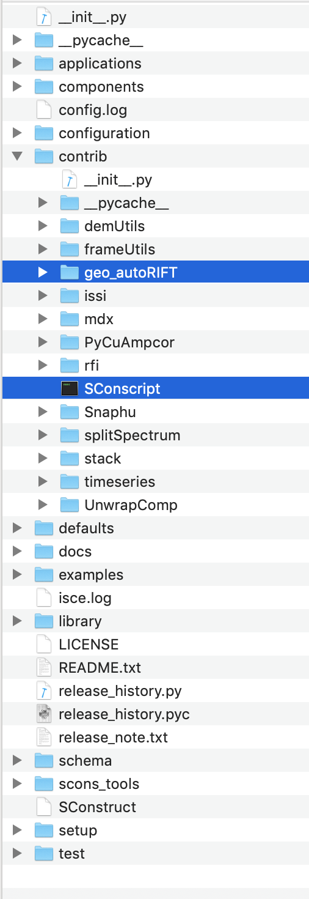

## 6. Install

### 6.1 With ISCE:

* First install ISCE2 (https://github.com/isce-framework/isce2)
* ***When installing ISCE v2.4+, autoRIFT (and Geogrid) will be installed automatically as a bundled package under contrib/geo_autoRIFT, so one can ignore the rest of the installation notes***
* For manually installing autoRIFT/Geogrid within ISCE, put the "geo_autoRIFT" folder and the "Sconscript" file under the "contrib" folder that is one level down ISCE's source directory (denoted as "isce-version"; where you started installing ISCE), i.e. "isce-version/contrib/" (see the snapshot below)

* Run "scons install" again from ISCE's source directory "isce-version" using command line, which will install the "autoRIFT" module as well as the "Geogrid" module (https://github.com/leiyangleon/Geogrid).

### 6.2 Standalone:

***1) Manual Install:***

* ***this option does not rely on ISCE so it cannot process radar images as the above install option does; rather, it can only handle optical Cartesian-coordinate images***
* Put the "geo_autoRIFT" folder and the "setup.py" file under some source directory (see the snapshot below)

* Run "python3 setup.py install" or "sudo python3 setup.py install" (if the previous failed due to permission restriction) using command line, which should install the "autoRIFT" module as well as the "Geogrid" module (https://github.com/leiyangleon/Geogrid)
* The standalone version only supports Cartesian coordinate imagery. However, if the above "With ISCE" version is installed independently, the standalone version can also support radar coordinate imagery.
* If the modules cannot be imported in Python environment, please make sure the path where these modules are installed (see "setup.py") to be added to the environmental variable $PYTHONPATH.

***2) Conda Install:***

* The source code "geo_autoRIFT" folder can also be installed via conda-forge channels. Please follow the instructions on the following page (with no more than three command lines):
    https://github.com/conda-forge/autorift-feedstock

