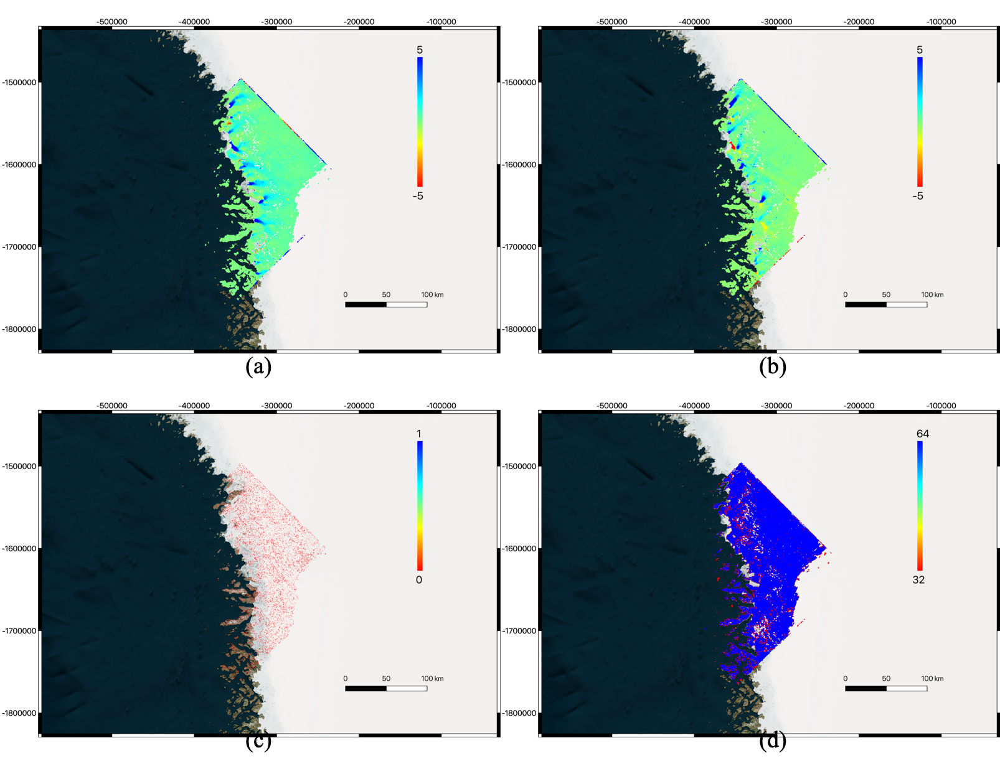
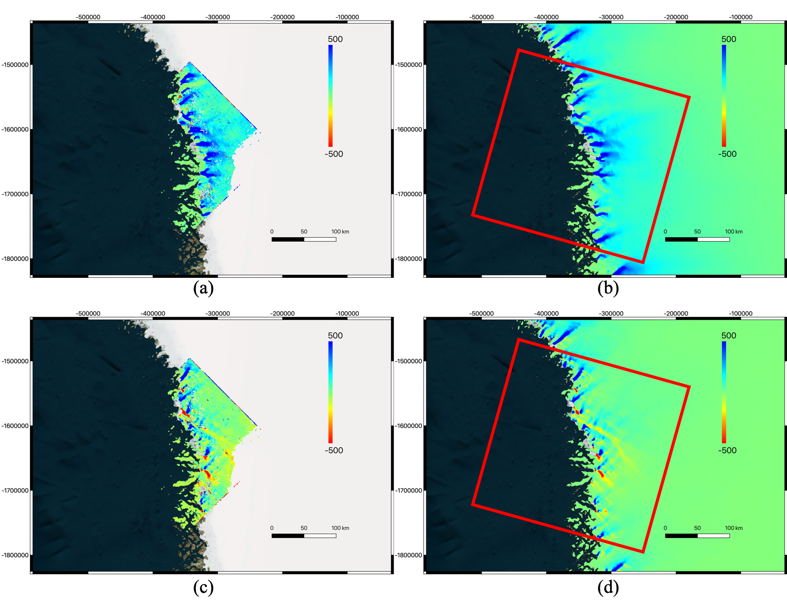

### 5.2 Optical image over user-defined map-projected Cartesian coordinate grid

***Output of "autoRIFT" module for a pair of Landsat-8 images (20170708-20170724; same as the Demo dataset at https://github.com/leiyangleon/Geogrid) in Greenland over user-defined map-projected Cartesian (northing/easting) coordinate grid (same grid used in the Demo at https://github.com/leiyangleon/Geogrid): (a) estimated horizontal pixel displacement (in pixels), (b) estimated vertical pixel displacement (in pixels), (c) light interpolation mask, (d) chip size used (in pixels). Notes: all maps are established exactly over the same map-projected Cartesian coordinate grid from input.***

This is done by implementing the following command line:

Standalone:
       
       testautoRIFT.py -m I1 -s I2 -g winlocname -o winoffname -sr winsrname -csmin wincsminname -csmax wincsmaxname -vx winro2vxname -vy winro2vyname -fo 1
       
With ISCE:

       testautoRIFT_ISCE.py -m I1 -s I2 -g winlocname -o winoffname -sr winsrname -csmin wincsminname -csmax wincsmaxname -vx winro2vxname -vy winro2vyname -fo 1
       
where "I1" and "I2" are the reference and secondary images as defined in the section of instructions below, and the optional inputs "winlocname", "winoffname", "winsrname", "wincsminname", "wincsmaxname", "winro2vxname", "winro2vyname" are outputs from running "testGeogrid_ISCE.py" or "testGeogridOptical.py" as defined at https://github.com/leiyangleon/Geogrid. For full/combinative use of these optional inputs, please refer to the section of instructions below. For the simplified use when the geocoded product is desired, "winlocname" (grid location) must be specified (otherwise it will become the demo in Section 5.1), and each of the rest optional input ("win * name") can be either used or omitted. Please remember to append the "-fo 1" flag for reading optical image data.

***Final motion velocity results by combining outputs from "Geogrid" (i.e. matrix of conversion coefficients from the Demo at https://github.com/leiyangleon/Geogrid) and "autoRIFT" modules (i.e. estimated horizontal/vertical pixel displacement shown above): (a) estimated motion velocity from Landsat-8 data (x-direction; in m/yr), (b) reference motion velocity from input data (x-direction; in m/yr), (c) estimated motion velocity from Landsat-8 data (y-direction; in m/yr), (d) reference motion velocity from input data (y-direction; in m/yr). Notes: all maps are established exactly over the same map-projected Cartesian (northing/easting) coordinate grid from input.***
