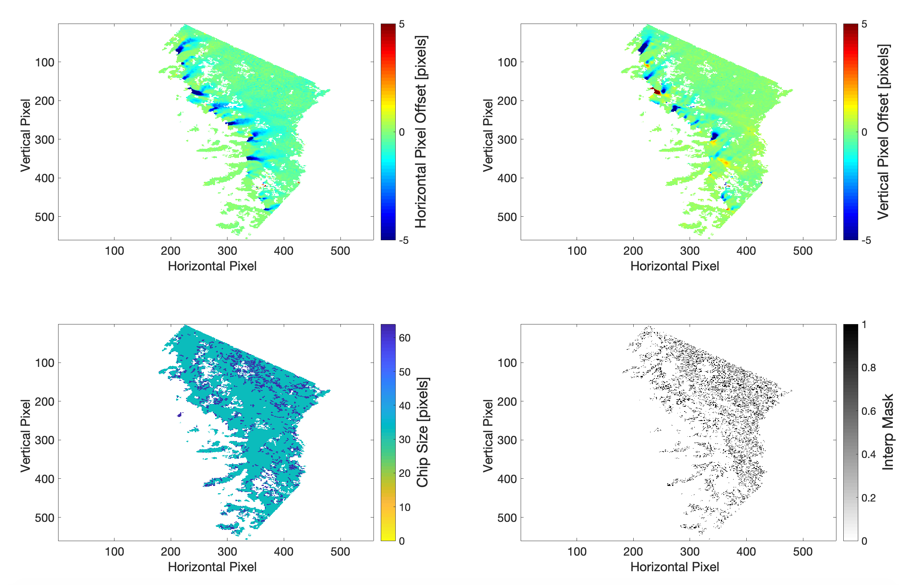

### 5.1 Optical image over regular grid in image coordinates

***Output of "autoRIFT" module for a pair of Landsat-8 images (20170708-20170724; same as the Demo dataset at https://github.com/leiyangleon/Geogrid) in Greenland over a regular-spacing grid: (a) estimated horizontal pixel displacement, (b) estimated vertical pixel displacement, (c) chip size used, (d) light interpolation mask.***

This is done by implementing the following command line:

Standalone:
       
       testautoRIFT.py -m I1 -s I2 -fo 1
       
With ISCE:
       
       testautoRIFT_ISCE.py -m I1 -s I2 -fo 1

where "I1" and "I2" are the reference and secondary images as defined in the section of instructions below. The "-fo" option indicates whether or not to read optical image data.
